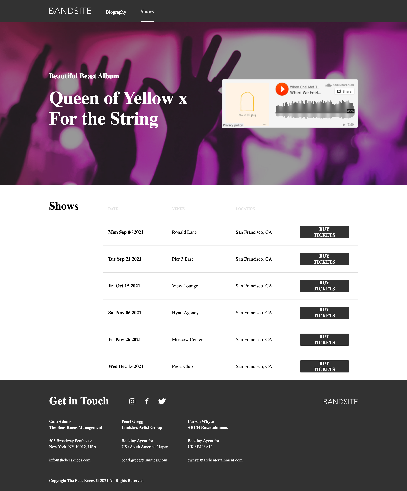

<!-- PROJECT LOGO -->
 

  <h3 align="center">BandSite Website</h3>

  

    A website for a contemporary band. It employee the use of HTML,CSS, JavaScript. 
     

  

<!-- ABOUT THE PROJECT -->
## About The Project

The website, Portfolio for a band is divided into the following sections:

* A header section with the logo and hero section with band name.
* A section for history of the band.
* A gallery section.
* A comment section.
* A page to buy tickets of their latest shows.

(<a href="#top">back to top</a>)

## Setup/Installation Requirements

To view the website, 
* click [Band Site Website](https://angrajlatake.github.io/bandsite/index.html)
or 
* copy the link https://github.com/angrajlatake/bandsite paste it to your browser and load it.  

### Built With

This section should list any major frameworks/libraries used to bootstrap your project. Leave any add-ons/plugins for the acknowledgements section. Here are a few examples.

* [HTML](https://www.w3.org/html/)
* [CSS](https://www.w3.org/Style/CSS/Overview.en.html)
* [SASS](https://sass-lang.com/)

(<a href="#top">back to top</a>)

